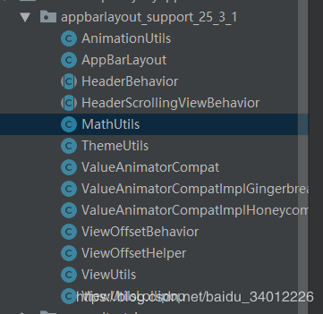

# PersonalHederZoomIn
个人主页放大缩小的项目

## Demo截图


个人主页的图片展示可以随着用户的下拉而被放大。

那么这个是怎么实现的呢？其实实现方式很简单AppBarLayout+CollapsingToolbarLayout+Toolbar+Behavior。

那难点是那么呢？难点是个支持库版本里面AppBarLayout的实现效果是不一样的。

我项目用的支持包是“27.1.1”版本，放大和缩小的效果有卡顿，有时候放大了就不缩小了。经过网上查找发现支持包“25.3.1”实现效果是我想要的。我不可能项目的支持包为了这一个效果而改成“25.3.1”，我只能把涉及到APPBarLayout的关键代码拷贝一份到项目中去，在多番尝试之后我把所有涉及的关键类都找出来了:



就这些文件了，把文件拷贝出来还有一个好处就是可以修改源码，为什么要修改源码下面会说到。先说说下拉图片放大缩小效果。
## Behavior
官方的介绍：Interaction behavior plugin for child views of CoordinatorLayout. 作用于CoordinatorLayout的子View的交互行为插件。一个Behavior 实现了用户的一个或者多个交互行为，它们可能包括拖拽、滑动、快滑或者其他一些手势。

它有几个重要的方法：
```java
/**
     * 表示是否给应用了Behavior 的View 指定一个依赖的布局，通常，当依赖的View 布局发生变化时
     * 不管被被依赖View 的顺序怎样，被依赖的View也会重新布局
     * @param parent
     * @param child 绑定behavior 的View
     * @param dependency   依赖的view
     * @return 如果child 是依赖的指定的View 返回true,否则返回false
     */
    @Override
    public boolean layoutDependsOn(CoordinatorLayout parent, View child, View dependency) {
        return super.layoutDependsOn(parent, child, dependency);
    }

    /**
     * 当被依赖的View 状态（如：位置、大小）发生变化时，这个方法被调用
     * @param parent
     * @param child
     * @param dependency
     * @return
     */
    @Override
    public boolean onDependentViewChanged(CoordinatorLayout parent, View child, View dependency) {
        return super.onDependentViewChanged(parent, child, dependency);
    }

    /**
     *  当coordinatorLayout 的子View试图开始嵌套滑动的时候被调用。当返回值为true的时候表明
     *  coordinatorLayout 充当nested scroll parent 处理这次滑动，需要注意的是只有当返回值为true
     *  的时候，Behavior 才能收到后面的一些nested scroll 事件回调（如：onNestedPreScroll、onNestedScroll等）
     *  这个方法有个重要的参数nestedScrollAxes，表明处理的滑动的方向。
     *
     * @param coordinatorLayout 和Behavior 绑定的View的父CoordinatorLayout
     * @param child  和Behavior 绑定的View
     * @param directTargetChild
     * @param target
     * @param nestedScrollAxes 嵌套滑动 应用的滑动方向，看 {@link ViewCompat#SCROLL_AXIS_HORIZONTAL},
     *                         {@link ViewCompat#SCROLL_AXIS_VERTICAL}
     * @return
     */
    @Override
    public boolean onStartNestedScroll(CoordinatorLayout coordinatorLayout, View child, View directTargetChild, View target, int nestedScrollAxes) {
        return super.onStartNestedScroll(coordinatorLayout, child, directTargetChild, target, nestedScrollAxes);
    }

    /**
     * 嵌套滚动发生之前被调用
     * 在nested scroll child 消费掉自己的滚动距离之前，嵌套滚动每次被nested scroll child
     * 更新都会调用onNestedPreScroll。注意有个重要的参数consumed，可以修改这个数组表示你消费
     * 了多少距离。假设用户滑动了100px,child 做了90px 的位移，你需要把 consumed［1］的值改成90，
     * 这样coordinatorLayout就能知道只处理剩下的10px的滚动。
     * @param coordinatorLayout
     * @param child
     * @param target
     * @param dx  用户水平方向的滚动距离
     * @param dy  用户竖直方向的滚动距离
     * @param consumed
     */
    @Override
    public void onNestedPreScroll(CoordinatorLayout coordinatorLayout, View child, View target, int dx, int dy, int[] consumed) {
        super.onNestedPreScroll(coordinatorLayout, child, target, dx, dy, consumed);
    }

    /**
     * 进行嵌套滚动时被调用
     * @param coordinatorLayout
     * @param child
     * @param target
     * @param dxConsumed target 已经消费的x方向的距离
     * @param dyConsumed target 已经消费的y方向的距离
     * @param dxUnconsumed x 方向剩下的滚动距离
     * @param dyUnconsumed y 方向剩下的滚动距离
     */
    @Override
    public void onNestedScroll(CoordinatorLayout coordinatorLayout, View child, View target, int dxConsumed, int dyConsumed, int dxUnconsumed, int dyUnconsumed) {
        super.onNestedScroll(coordinatorLayout, child, target, dxConsumed, dyConsumed, dxUnconsumed, dyUnconsumed);
    }

    /**
     *  嵌套滚动结束时被调用，这是一个清除滚动状态等的好时机。
     * @param coordinatorLayout
     * @param child
     * @param target
     */
    @Override
    public void onStopNestedScroll(CoordinatorLayout coordinatorLayout, View child, View target) {
        super.onStopNestedScroll(coordinatorLayout, child, target);
    }

    /**
     * onStartNestedScroll返回true才会触发这个方法，接受滚动处理后回调，可以在这个
     * 方法里做一些准备工作，如一些状态的重置等。
     * @param coordinatorLayout
     * @param child
     * @param directTargetChild
     * @param target
     * @param nestedScrollAxes
     */
    @Override
    public void onNestedScrollAccepted(CoordinatorLayout coordinatorLayout, View child, View directTargetChild, View target, int nestedScrollAxes) {
        super.onNestedScrollAccepted(coordinatorLayout, child, directTargetChild, target, nestedScrollAxes);
    }

    /**
     * 用户松开手指并且会发生惯性动作之前调用，参数提供了速度信息，可以根据这些速度信息
     * 决定最终状态，比如滚动Header，是让Header处于展开状态还是折叠状态。返回true 表
     * 示消费了fling.
     *
     * @param coordinatorLayout
     * @param child
     * @param target
     * @param velocityX x 方向的速度
     * @param velocityY y 方向的速度
     * @return
     */
    @Override
    public boolean onNestedPreFling(CoordinatorLayout coordinatorLayout, View child, View target, float velocityX, float velocityY) {
        return super.onNestedPreFling(coordinatorLayout, child, target, velocityX, velocityY);
    }

    //可以重写这个方法对子View 进行重新布局
    @Override
    public boolean onLayoutChild(CoordinatorLayout parent, View child, int layoutDirection) {
        return super.onLayoutChild(parent, child, layoutDirection);
    }
```
我们可以通过重写上面的方法来改变子View的一些行为。

这里放上缩放和复原的代码：
```java
 private void scale(AppBarLayout abl, View target, int dy) {
        mTotalDy += -dy;
        mTotalDy = Math.min(mTotalDy, TARGET_HEIGHT);
        mLastScale = Math.max(1f, 1f + mTotalDy / TARGET_HEIGHT);
        ViewCompat.setScaleX(mTargetView, mLastScale);
        ViewCompat.setScaleY(mTargetView, mLastScale);
        mLastBottom = mParentHeight + (int) (mTargetViewHeight / 2 * (mLastScale - 1));
        abl.setBottom(mLastBottom);
        target.setScrollY(0);

        middleLayout.setTop(mLastBottom - mMiddleHeight);
        middleLayout.setBottom(mLastBottom);

        mPersonalInfoLayout.setBottom(mLastBottom - mMiddleHeight);
        mPersonalInfoLayout.setTop(mLastBottom - mMiddleHeight - mPersonalInfoHeight);

        if (onProgressChangeListener != null) {
            //计算0~1的进度
            float progress = Math.min((mLastScale - 1) / MAX_REFRESH_LIMIT, 1);
            onProgressChangeListener.onProgressChange(progress, false);
        }
    }
 private void recovery(final AppBarLayout abl) {
        if (isRecovering) {
            return;
        }
        if (mTotalDy > 0) {
            isRecovering = true;
            mTotalDy = 0;
            if (isAnimate) {
                ValueAnimator anim = ValueAnimator.ofFloat(mLastScale, 1f).setDuration(200);
                anim.addUpdateListener(
                        new ValueAnimator.AnimatorUpdateListener() {
                            @Override
                            public void onAnimationUpdate(ValueAnimator animation) {
                                float value = (float) animation.getAnimatedValue();
                                ViewCompat.setScaleX(mTargetView, value);
                                ViewCompat.setScaleY(mTargetView, value);
                                abl.setBottom((int) (mLastBottom - (mLastBottom - mParentHeight) * animation.getAnimatedFraction()));
                                middleLayout.setTop((int) (mLastBottom - (mLastBottom - mParentHeight) * animation.getAnimatedFraction() - mMiddleHeight));
                                mPersonalInfoLayout.setTop((int) (mLastBottom - (mLastBottom - mParentHeight) * animation.getAnimatedFraction() - mMiddleHeight) - mPersonalInfoHeight);

                                if (onProgressChangeListener != null) {
                                    //计算0~1的进度
                                    float progress = Math.min((value - 1) / MAX_REFRESH_LIMIT, 1);
                                    onProgressChangeListener.onProgressChange(progress, true);
                                }
                            }
                        }
                );
                anim.addListener(new Animator.AnimatorListener() {
                    @Override
                    public void onAnimationStart(Animator animation) {
                    }

                    @Override
                    public void onAnimationEnd(Animator animation) {
                        isRecovering = false;
                    }

                    @Override
                    public void onAnimationCancel(Animator animation) {
                    }

                    @Override
                    public void onAnimationRepeat(Animator animation) {
                    }
                });
                anim.start();
            } else {
                ViewCompat.setScaleX(mTargetView, 1f);
                ViewCompat.setScaleY(mTargetView, 1f);
                abl.setBottom(mParentHeight);
                middleLayout.setTop(mParentHeight - mMiddleHeight);
                mPersonalInfoLayout.setTop(mParentHeight - mMiddleHeight - mPersonalInfoHeight);

                isRecovering = false;

                if (onProgressChangeListener != null) {
                    onProgressChangeListener.onProgressChange(0, true);
                }
            }
        }
    }
```
还有几个小细节需要注意：

1、所有需要滚动的控件都必须被NestedScrollView包裹

2、需要被缩放的布局需要加上 android:clipChildren="false"    android:clipToPadding="false" 属性。
## 自定义snap效果(这个地方就需要修改源码)
仔细观察上面的效果图，你会发现只要我的手指稍微有一点上滑或者下滑的趋势，视图就会自动向上运动或者向下运动，如果用原生控件自带的snap效果是不行的。app:layout_scrollFlags="scroll|exitUntilCollapsed|snap"中的snap是在用户滑动到AppBarLayout布局高度的一半才会自动上合或者下合，这个我们可以在源码（support-25.3.1）中证实它。
```java
private void snapToChildIfNeeded(CoordinatorLayout coordinatorLayout, AppBarLayout abl) {
            final int offset = getTopBottomOffsetForScrollingSibling();
            final int offsetChildIndex = getChildIndexOnOffset(abl, offset);
            if (offsetChildIndex >= 0) {
                final View offsetChild = abl.getChildAt(offsetChildIndex);
                final LayoutParams lp = (LayoutParams) offsetChild.getLayoutParams();
                final int flags = lp.getScrollFlags();

                if ((flags & LayoutParams.FLAG_SNAP) == LayoutParams.FLAG_SNAP) {
                    // We're set the snap, so animate the offset to the nearest edge
                    int snapTop = -offsetChild.getTop();
                    int snapBottom = -offsetChild.getBottom();

                    if (offsetChildIndex == abl.getChildCount() - 1) {
                        // If this is the last child, we need to take the top inset into account
                        snapBottom += abl.getTopInset();
                    }

                    if (checkFlag(flags, LayoutParams.SCROLL_FLAG_EXIT_UNTIL_COLLAPSED)) {
                        // If the view is set only exit until it is collapsed, we'll abide by that
                        snapBottom += ViewCompat.getMinimumHeight(offsetChild);
                    } else if (checkFlag(flags, LayoutParams.FLAG_QUICK_RETURN
                            | LayoutParams.SCROLL_FLAG_ENTER_ALWAYS)) {
                        // If it's set to always enter collapsed, it actually has two states. We
                        // select the state and then snap within the state
                        final int seam = snapBottom + ViewCompat.getMinimumHeight(offsetChild);
                        if (offset < seam) {
                            snapTop = seam;
                        } else {
                            snapBottom = seam;
                        }
                    }

                    final int newOffset = offset < (snapBottom + snapTop) / 2
                            ? snapBottom
                            : snapTop;
                    animateOffsetTo(coordinatorLayout, abl,
                            MathUtils.constrain(newOffset, -abl.getTotalScrollRange(), 0), 0);
                }
            }
        }
```
可以看到newOffset=offset < (snapBottom + snapTop) / 2 ? snapBottom : snapTop，当offset小于snapBottom+snapTop的一半是就赋值为snapBottom，反之，赋值为snapTop。offset就是AppBarLayout滑动的距离，snapBottom和snapTop可以理解为AppBarLayout的底和高。

我是这样自定一个这个snap效果触发的时机的，我增加了一个snapDistance，然后增加一个laseStateIsSnaptop用来记录上一次snap的状态是否为滑动到顶部。
```java
 /**
   * 上一次的状态是否为滑动到顶部
   */
  private boolean laseStateIsSnaptop = true;

   /**
    * 开始snap的距离，默认30dip
    */
   private int snapDistance = 30;

    private void snapToChildIfNeeded(CoordinatorLayout coordinatorLayout, AppBarLayout abl) {
        final int offset = getTopBottomOffsetForScrollingSibling();
        final int offsetChildIndex = getChildIndexOnOffset(abl, offset);
        if (offsetChildIndex >= 0) {
            final View offsetChild = abl.getChildAt(offsetChildIndex);
            final LayoutParams lp = (LayoutParams) offsetChild.getLayoutParams();
            final int flags = lp.getScrollFlags();

            if ((flags & LayoutParams.FLAG_SNAP) == LayoutParams.FLAG_SNAP) {
                // We're set the snap, so animate the offset to the nearest edge
                int snapTop = -offsetChild.getTop();
                int snapBottom = -offsetChild.getBottom();

                if (offsetChildIndex == abl.getChildCount() - 1) {
                    // If this is the last child, we need to take the top inset into account
                    snapBottom += abl.getTopInset();
                }

                if (checkFlag(flags, LayoutParams.SCROLL_FLAG_EXIT_UNTIL_COLLAPSED)) {
                    // If the view is set only exit until it is collapsed, we'll abide by that
                    snapBottom += ViewCompat.getMinimumHeight(offsetChild);
                } else if (checkFlag(flags, LayoutParams.FLAG_QUICK_RETURN
                        | LayoutParams.SCROLL_FLAG_ENTER_ALWAYS)) {
                    // If it's set to always enter collapsed, it actually has two states. We
                    // select the state and then snap within the state
                    final int seam = snapBottom + ViewCompat.getMinimumHeight(offsetChild);
                    if (offset < seam) {
                        snapTop = seam;
                    } else {
                        snapBottom = seam;
                    }
                }

                int newOffset;

                //snapBottom:-1198
                //snapTop:0
                //offset:0~-1198  bottom时0  top时-1198
                if (laseStateIsSnaptop) {
                    //上一次的状态是滑动到的顶部
                    if (Math.abs(offset) > getSnapDistance(abl.getContext())) {
                        //需要滑动到底部
                        laseStateIsSnaptop = false;
                        newOffset = snapBottom;
                    } else {
                        //需要滑动到顶部
                        laseStateIsSnaptop = true;
                        newOffset = snapTop;
                    }
                } else {
                    //上一次的状态是滑动到的底部
                    if (Math.abs(abl.getTotalScrollRange()) - Math.abs(offset) > getSnapDistance(abl.getContext())) {
                        laseStateIsSnaptop = true;
                        //需要滑动到顶部
                        newOffset = snapTop;
                    } else {
                        //需要滑动到底部
                        laseStateIsSnaptop = false;
                        newOffset = snapBottom;
                    }
                }

                animateOffsetTo(coordinatorLayout, abl,
                        MathUtils.constrain(newOffset, -abl.getTotalScrollRange(), 0), 0);
            }
        }
    }

    private int getSnapDistance(Context context) {
        return UIUtil.dip2px(context, snapDistance);
    }
```
这里我默认赋值的是30dp，也可以增加一个set方法从外面赋值，使它更加灵活。

详细介绍：[看这里](https://blog.csdn.net/baidu_34012226/article/details/87708476)